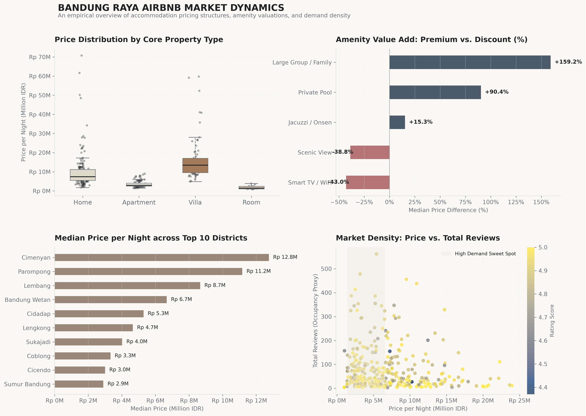

# Bandung Raya Airbnb Market Dynamics: End-to-End Analytics & Pricing Valuation

An end-to-end data analytics project evaluating accommodation pricing structures, amenity valuations, and demand density across Bandung Raya using PostgreSQL, Python, and statistical visualizations.

---

## Executive Summary & Key Findings
* **Market Disparity by Geography:** Northern/highland districts command the highest pricing power, led by **Cimenyan (Rp 12.8M median)**, **Parompong (Rp 11.2M)**, and **Lembang (Rp 8.7M)** due to scenic villa clusters. Urban transit districts like **Sumur Bandung (Rp 2.9M)** and **Cicendo (Rp 3.0M)** cater to high-frequency budget travelers.
* **Amenity Value Add:** Integrating **Private Pool** facilities drives a **+90.4% price premium** (Median Rp 10.8M vs Rp 5.7M), while positioning for **Large Family/Groups** commands a **+159.2% premium**.
* **Demand Elasticity & Sweet Spot:** High-transaction occupancy (*measured by review volume*) heavily clusters within the **Rp 1.5M – Rp 6.5M per night** window. Listings above Rp 15M exhibit slower turnover, functioning as exclusive luxury retreats.
* **Data Hygiene (Scraping Bleed):** Identified and isolated **31.1% (178 rows)** of out-of-scope listings (Bogor/Puncak) mistakenly included in raw data, preserving true local market metrics across 394 clean Bandung listings.

---

## Market Dynamics Dashboard

---

## Tech Stack & Workflow
* **Database & Ingestion:** PostgreSQL (Staging DDL, Regex Data Cleansing, Schema Constraints).
* **Analytics & NLP Extraction:** Python (Pandas, NumPy, Regex for unstructured listing titles).
* **Data Visualization:** Matplotlib & Seaborn (Minimalist styling, Distribution Boxplots, Elasticity Scatter).

---

## Repository Structure
Indonesia_airbnb_dataset_bandung
├── data/
│   ├── AirBnB_BandungRaya_All.csv    # Raw scraped dataset
│   └── clean_airbnb_bandung.csv      # Processed clean dataset
├── sql/
│   ├── data_cleaning.sql             # Ingestion & cleaning DDL
│   └── analysis.sql                  # Business metric queries
├── notebook.ipynb                    # Feature extraction & visualization code
├── airbnb_bandung_minimalist.png     # Visual summary asset
└── README.md